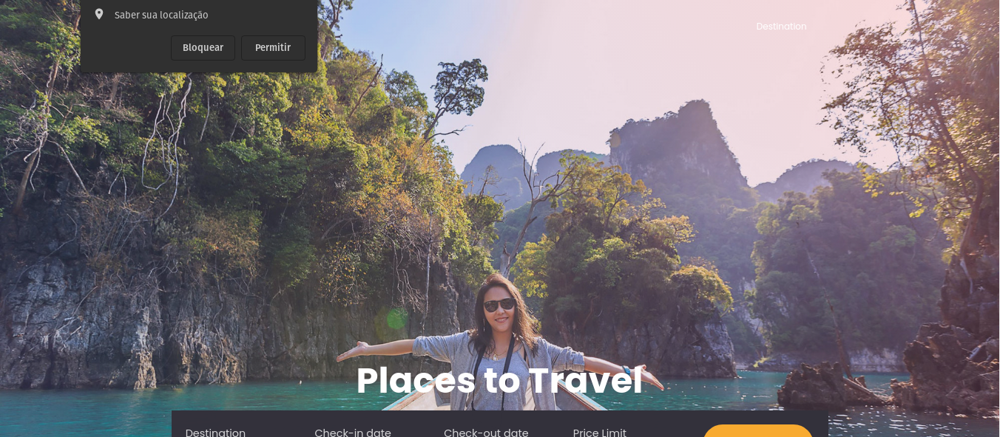
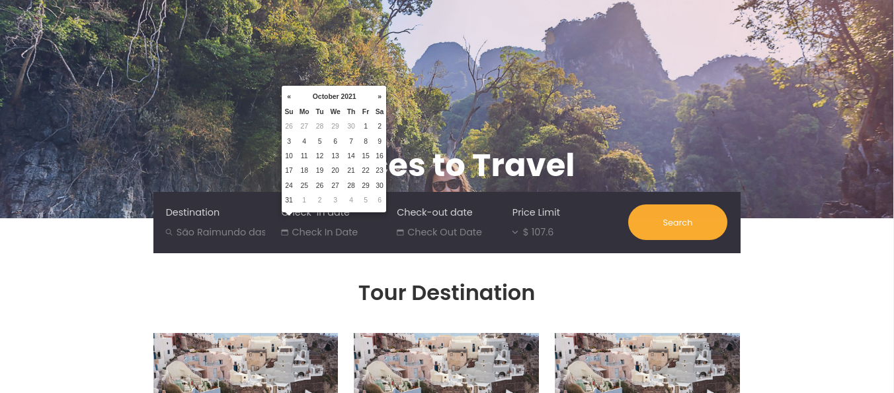
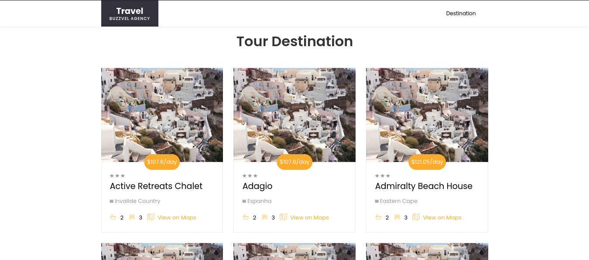

   

  
    

  

##

### Informações do projeto:

**Descrição:**  O projeto TravelBuzz tem como objetivo retornar os hotéis mais próximos de um ponto de origem indicado pelo usuário ordenando-os por proximidade ou preço por noite de acordo com a preferência do mesmo.

**Tecnologias utilizadas no projeto:** <code></code>, <code></code>,  <code></code>,  <code></code>, <code></code>, <code></code> e <code></code>. 

**Integrações:** Google Maps (geocode e distancematrix) juntamente com o endpoint de listagem de hotéis da Buzzvel.     

### Interface do projeto:

  
    <code></code>
    <code></code>
    <code></code>

### Configurando projeto docker: <code></code>

Primeiramente, renomeie o arquivo ".evn-example" da raiz do projeto para ".env".  
**Em seguida execute o comando docker abaixo pelo terminal na raiz do projeto para configurar o ambiente de desenvolvimento Docker:**

`$ docker-compose build app`

**Para executar o ambiente de desenvolvimento, digite o comando docker abaixo:**

`$ docker-compose up -d`

**Isso executará seus contêineres em segundo plano. Para mostrar informações sobre o estado de seus serviços ativos, execute:**

`$ docker-compose ps`

## Instalando as dependências do projeto

**Execute o composer install para instalar as dependências do aplicativo:**

`$ composer install`

### Gerando nova key Laravel:

A última coisa que precisamos fazer antes de testar o aplicativo é gerar uma chave única para o aplicativo com a artisan, a ferramenta de linha de comando do Laravel. Esta chave é usada para criptografar sessões de usuário e outros dados sensíveis:

`$ php artisan key:generate`

### Preparando aplicação para uso:

Execute o comando abaixo para que o artisan do laravel configure o banco de dados e popule a tabela hotel a partir do seeder configurado

rodand as migrations

`$ php artisan migrate`

populando o banco de dados

`$ php artisan db:seed`

**Obs. O comando de migrate levara um tempo para finalizar sua execução, pois além de criar as tabelas necessárias para o funcionamento do siste, será executado o seeder responsável por popular a tabela hotel a partir do consumo da api buzzvel**

### Acessando o projeto pelo navegador:

Em uma nova aba no seu navegador acesse o nome de domínio ou endereço IP do seu servidor na porta 8000, ou clique no link abaixo:

[Clique aqui para acessar o projeto](http://localhost:8000)